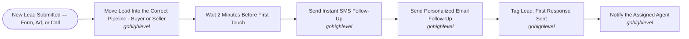

# Real Estate Speed-to-Lead — Correct Pipeline + Instant SMS/Email Follow-Up

```mermaid
flowchart LR
    trig(["New Lead Submitted — Form, Ad, or Call"])
    assign["Move Lead Into the Correct Pipeline · Buyer or Seller<br/><i>gohighlevel</i>"]
    wait["Wait 2 Minutes Before First Touch"]
    send_sms["Send Instant SMS Follow-Up<br/><i>gohighlevel</i>"]
    send_email["Send Personalized Email Follow-Up<br/><i>gohighlevel</i>"]
    tag_lead["Tag Lead: First Response Sent<br/><i>gohighlevel</i>"]
    notify_agent["Notify the Assigned Agent<br/><i>gohighlevel</i>"]
    trig --> assign
    assign --> wait
    wait --> send_sms
    send_sms --> send_email
    send_email --> tag_lead
    tag_lead --> notify_agent
```

